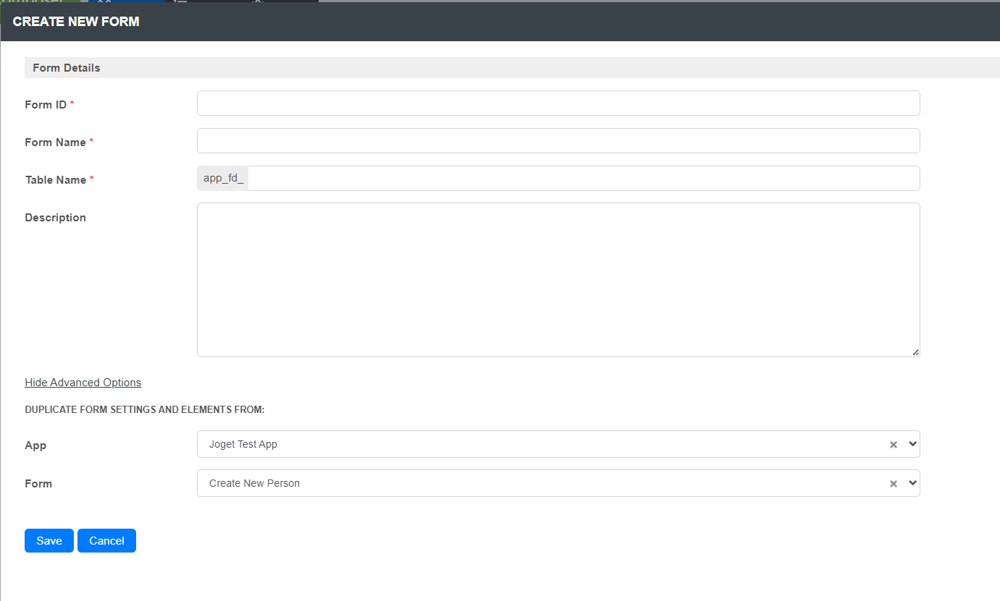
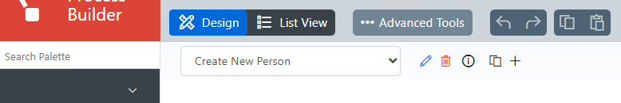
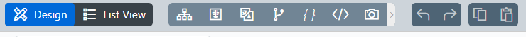

# Component reuse between Joget Applications
## Reusing Forms, Lists and UIs
Copying components like **Forms, Lists** and **UI Builders** between apps is done through an identical form where the **Show Advanced Options** button is clicked and the App and Form/List/UI are selected.

## Reusing Processes
Copying processes should basically start by copying the components used in the copied process.

Clicking **Advanced Tools** in the Process Builder gives us the option to copy the **JSON** (fifth option) / **XPDL** (sixth option) source code of the process.

Choosing either of the two shows the code where **the objects** below **ARE MERGED** with the JSON definition of the current project so that the current progress is not lost!

- **WorkflowProcesses**
- **Participants** in the **xpdl** object
- **activityForms**
- **activityPlugins**
- **participants**
