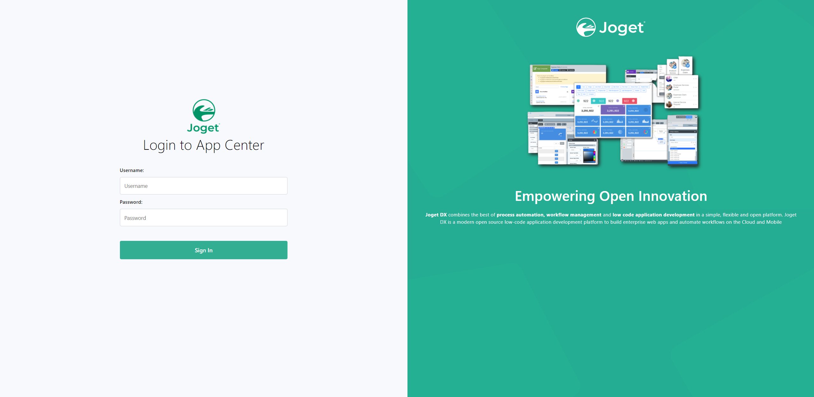
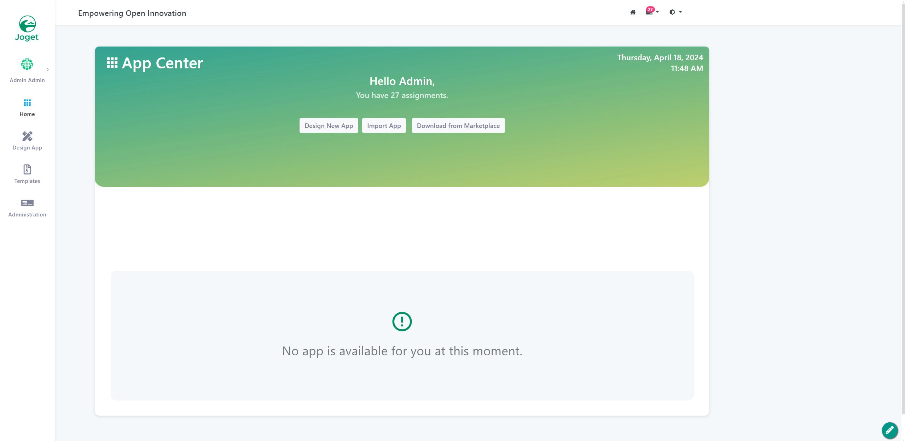
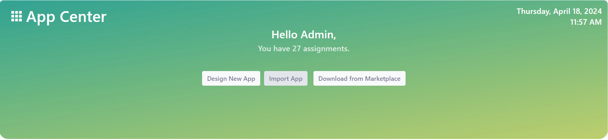
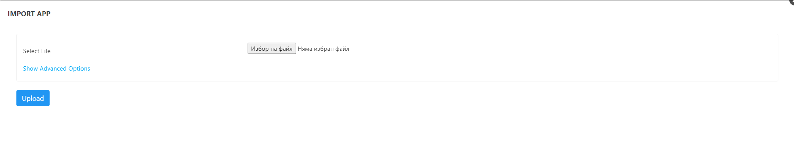
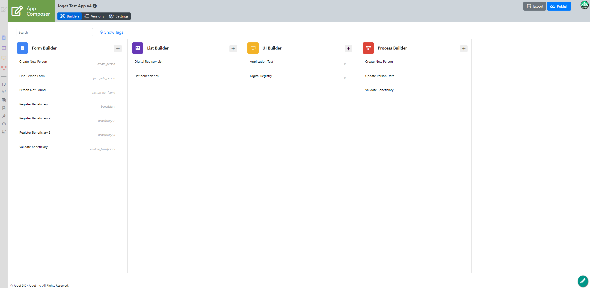
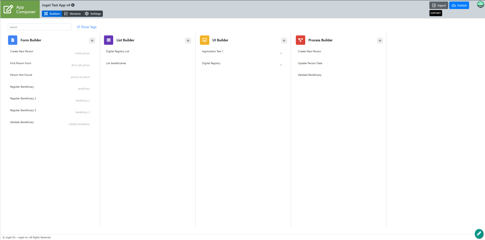
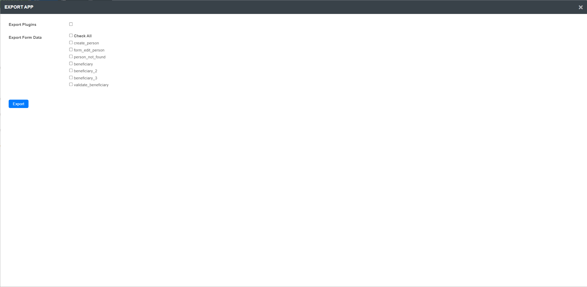

# Export and import Joget applications

## Joget Import

### Login Screen
After accessing Joget's dashboard URL a login will be required.

### JOGET Dashboard
Joget's Dashboard allows the users to design new apps, import existing ones or download app from the Marketplace. It provides administration tools for users with "admin" rights such as reviewing assignments, statistics for forms, lists, processes in the developed apps.

**Import App** button leads to a file selection popup for uploading an existing app. Files should be in the .jwa file format.

### Import App

In our case the file is called **Joget-Process-Test-App-2024-04-17.jwa**.
You can find our example project in  [here](./../assets/export/Joget-Process-Test-App-2024-04-17.jwa)

The project without the test components and workflows is called **Joget-Process-App-2024-04-17.jwa** and is available for import [here](./../assets/export/Joget-Process-App-2024-04-17.jwa)

After selecting the file click **Upload** button to upload the app file.

Page is automatically reloaded but if you have disabled popup windows in your browser it might fail reloading so we have to click **Launch App Composer** button to redirect manually.

### App Composer (App Overview)

After a successful import of the app an **App Composer** screen will appear which contains the different app components such as Forms, Lists, UIs and Processes with their corresponding builders. In this screen the different components can be launched, deleted or modified.

## Joget Export

After finishing our app's design - all of the components (forms, lists, UIs and processes) are correctly built with no errors present we can export the app through the **Export** button in the upper right corner of the **App Composer** screen.

After clicking the **Export** button a popup with export options appears. 

If the projects doesn't have any unused resources all components are selected to be exported. If any plugins are used in the app's design they are selected as well. In the case of **Joget Test App** (The app from screenshots) none were used so none were to be selected. 

Clicking the **Export** button creates a file to be shared with the relative departments.