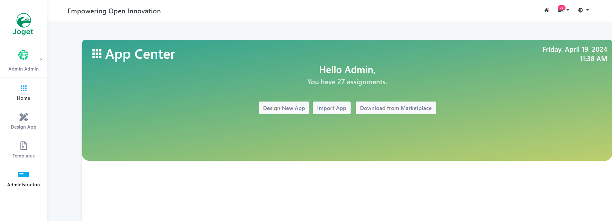
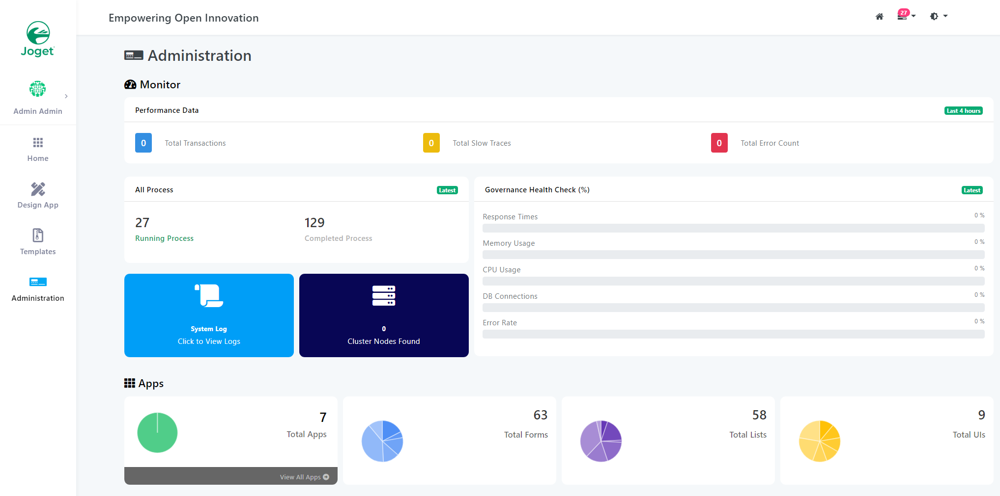
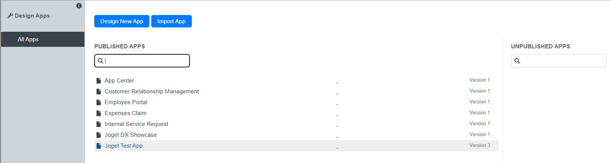
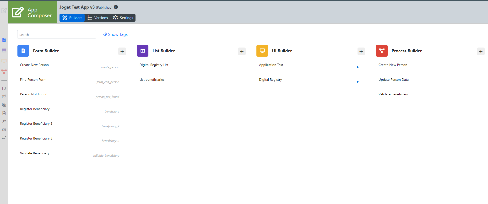
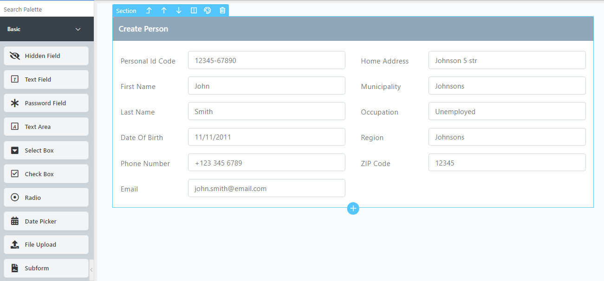
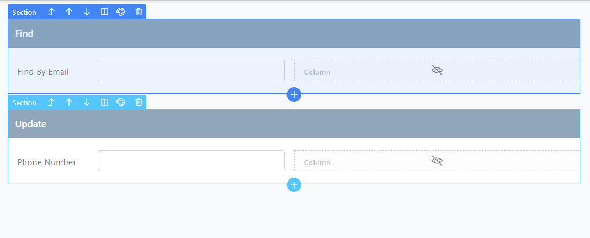
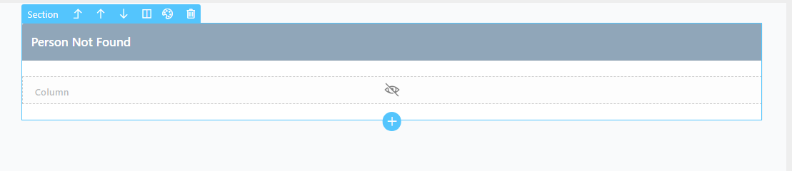
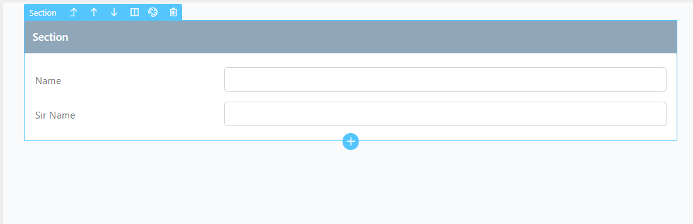
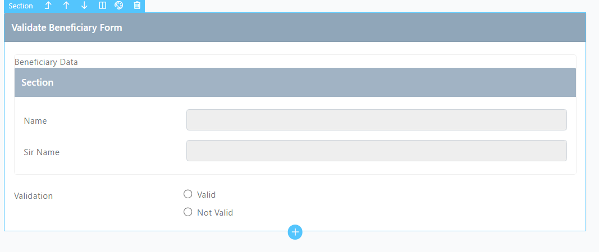

# Joget Forms using GovStack Building Block
## Opening Joget Test App
If the imported app does not appear in the **App Center** (Dashboard) clicking **Administration** in the left navigation menu opens the administration panel showing projects and process statistics.

In the Apps section a **View All Apps** button is to be clicked and then the **Joget Test App** is selected.

## Create And Edit Forms

Opening the **App Composer** shows a preview of all components in the App. To edit **Forms** there is a Form Builder **"+"** sign or the **Add new form** item is selected from the **Form Builder** navigation menu item.

All forms can be preview but not launched using the **Preview** tab. Launching or previewing the form submission happens through already created [UI](../docs/ui.md) or a [Process](../docs/process.md)

### Create New Person

In the **Design** tab the label for the automatically created section can be edited clicking the section itself.

Drag and drop items from the **Basic** section for the appropriate fields (currently Text Fields only). **Labels** and **IDs** for the items are to be modified by clicking the item itself and modifying **Properties** tab.

### Update Person

Similarly to the [Create New Person Form](#create-new-person) a new form is created and two sections are added:
1. Find Section - Contains Two Columns (two for styling purposes only) first one with an **Email** text field for the person search and second one being an empty column.
2. Update (with) Section - Has **Phone Number** field needed for the [Update Person Process](../docs/process.md#UpdatePersonProcess)

### Person Not Found

This form is to show no people are found by the supplied email in the [Update Person Process](../docs/process.md#UpdatePersonProcess) - Only has a label on the section.

### Register Beneficiary

### Validate Beneficiary

The Validate Beneficiary Form has two sections:
1. First Section has a **Subform** element containing the [Register Beneficiary Form](#register-beneficiary)
2. Radio Section with two options available - Valid and Not Valid, configured in **Properties** tab of the item.

After form submission the **workflow variable** `status` is set to either one of the radio buttons depending on the selection.

### Form Settings

All forms are created with the settings tab having **Default** as chosen for the **Data** fields:
1. Load Data From
2. Save Data To

### It is recommended to click **Apply Change** after every change made and click Save button in the top right corner to save the progress otherwise it may be lost!