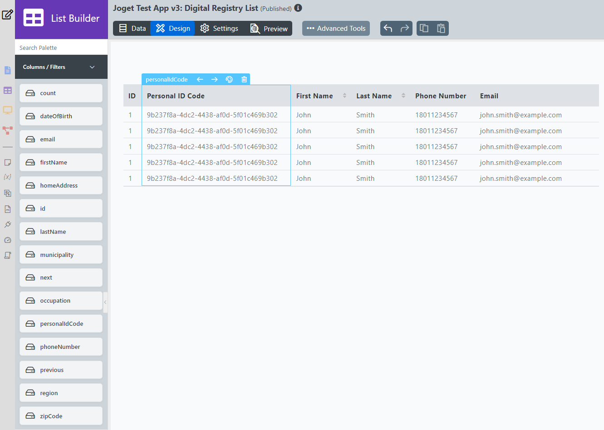
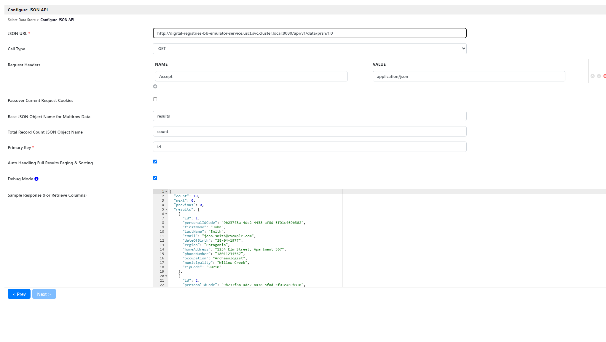
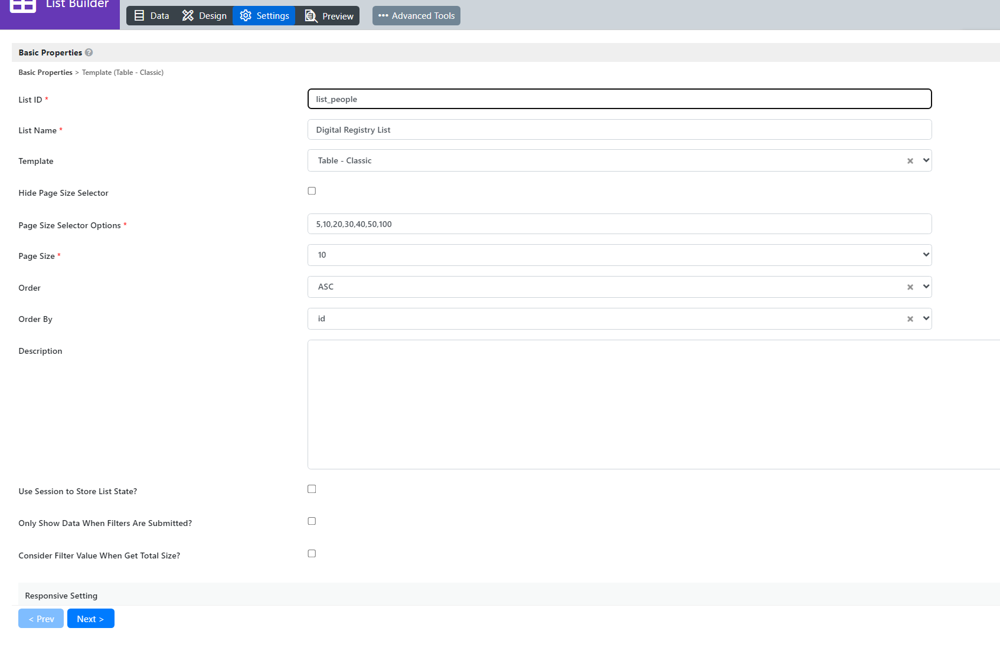
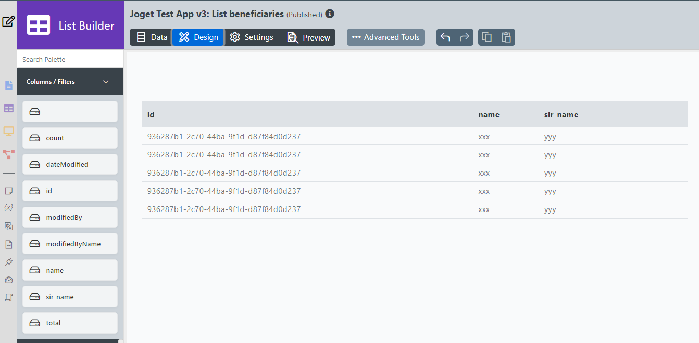
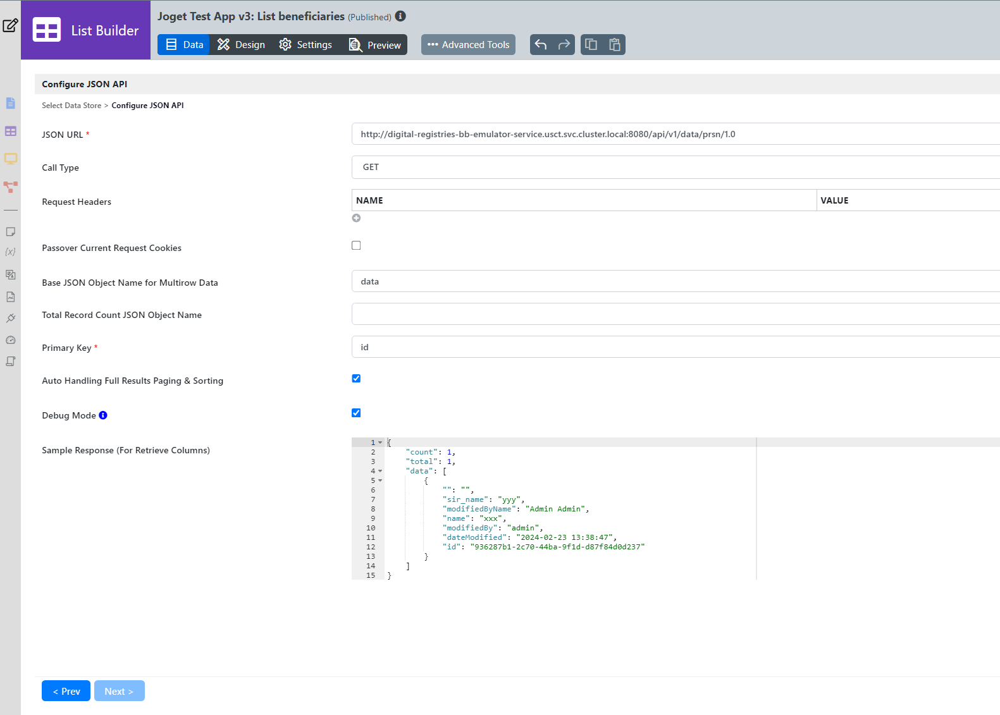

# Joget Lists using GovStack Building Block
## Opening Joget Test App
If the App is not visible in the dashboard follow [View App Procedure](../docs/forms.md#opening-joget-test-app).

## Create And Edit Lists
Create a new **List** through List Builder navigation item or through the **App Composer** screen.

### Digital Registry BB Emulator List



Six **columns** are added to the table. Editing the labels of the columns can be modified in the properties of each column as well as configuring them to be sortable, hidden or others. The fields in the current table are:
1. ID
2. Personal ID Code
3. First Name
4. Last Name
5. Phone Number
6. Email

All of the fields available for the table are visible in the **Columns/Filters** navigation item.

Configure the data source:
1. Set Source of Data to **JSON API** in the **Data** tab of the list
2. **JSON URL**:
```
http://digital-registries-bb-emulator-service.usct.svc.cluster.local:8080/api/v1/data/prsn/1.0
```
3. **Call Type** set to `GET`
4. **Request Headers**:
```
Accept: application/json
```
5. **Base JSON Object** set to `results`
6. **Total Record Cound** set to `count`
7. **Primary Key** is `id`
8. **Debug Mode** creates records in the **Log** (last option in the navigation menu on the left)
9. **Sample Response**:
```
{
  "count": 10,
  "next": 0,
  "previous": 0,
  "results": [
    {
      "id": 1,
      "personalIdCode": "9b237f8a-4dc2-4438-af0d-5f01c469b302",
      "firstName": "John",
      "lastName": "Smith",
      "email": "john.smith@example.com",
      "dateOfBirth": "28-04-1977",
      "region": "Patagonia",
      "homeAddress": "1234 Elm Street, Apartment 567",
      "phoneNumber": "18011234567",
      "occupation": "Archaeologist",
      "municipality": "Willow Creek",
      "zipCode": "90210"
    },
    {
      "id": 2,
      "personalIdCode": "9b237f8a-4dc2-4438-af0d-5f01c469b310",
      "firstName": "Emma",
      "lastName": "Smith",
      "email": "emma.smith@example.com",
      "dateOfBirth": "28-04-1977",
      "region": "Transylvania",
      "homeAddress": "1234 Elm Street, Apartment 567",
      "phoneNumber": "18011234567",
      "occupation": "Archaeologist",
      "municipality": "Willow Creek",
      "zipCode": "90210"
    }
  ]
}
```



In the **Settings** tab are configured labels, default + custom table row count, ordering, etc.




### Digital Registry BB Emulator Beneficiaries List



Similarly to the other list three **columns** are added to the table and modified accordingly. The fields in the current table are:
1. ID
2. Name
6. Sirname

All of the fields available for the table are visible in the **Columns/Filters** navigation item.

Configure the data source:
1. Set Source of Data to **JSON API** in the **Data** tab of the list
2. **JSON URL**:
```
http://digital-registries-bb-emulator-service.usct.svc.cluster.local:8080/api/v1/data/prsn/1.0
```
3. **Call Type** set to `GET`
4. **Request Headers**:
```
Accept: application/json
```
5. **Base JSON Object** set to `data`
7. **Primary Key** is `id`
8. **Debug Mode** creates records in the **Log** (last option in the navigation menu on the left)
9. **Sample Response**:
```
{
    "count": 1,
    "total": 1,
    "data": [
        {
            "": "",
            "sir_name": "yyy",
            "modifiedByName": "Admin Admin",
            "name": "xxx",
            "modifiedBy": "admin",
            "dateModified": "2024-02-23 13:38:47",
            "id": "936287b1-2c70-44ba-9f1d-d87f84d0d237"
        }
    ]
}
```



Table settings are set to the defaults.

Lists can be previewed with data coming from the datasource directly in **Preview** tab, through [UI](../docs/ui.md) or through [Process](../docs/process.md).

### It is recommended to click **Apply Change** after every change made and click Save button in the top right corner to save the progress otherwise it may be lost!