# UI Builder
## Opening Joget Test App
If the App is not visible in the dashboard follow [View App Procedure](../docs/forms.md#opening-joget-test-app).

## Create and Edit UI
Create a new **UI** through UI Builder navigation item or through the **App Composer** screen.

There is a difference between inserting a **Run Process** item and the individual **Form** (where the form is submitted without actions afterwards) or **List** (where a list is displayed) items.

## Digital Registry UI

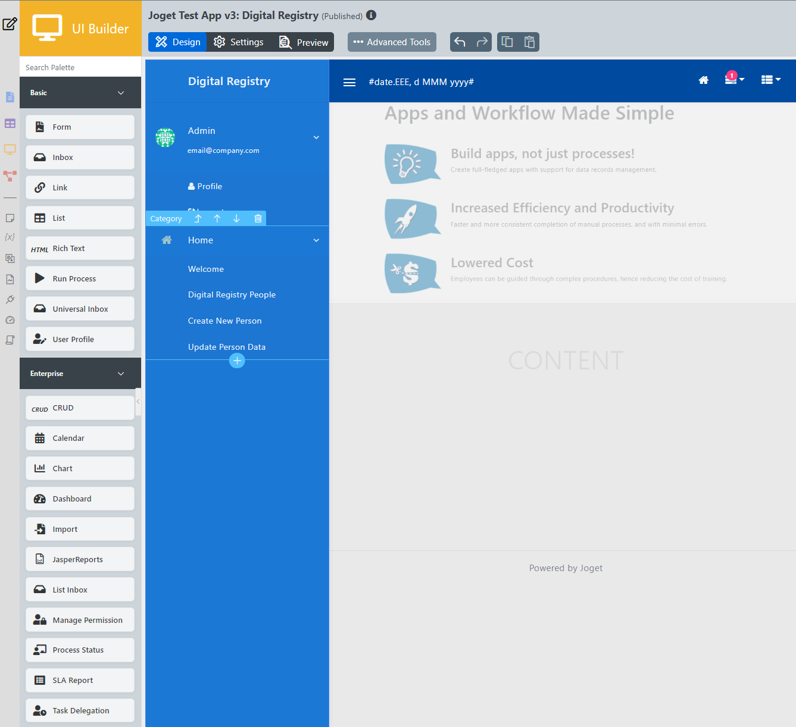

The Digital Registry UI consists of several default side navigation items + 3 custom ones connected to Digital Registry BB Emulator (DR):
1. Emulator's DB list of people
2. Create new person in the Digital Registry's DB
3. Update person in Digital Registry's DB

#### Digital Registry List
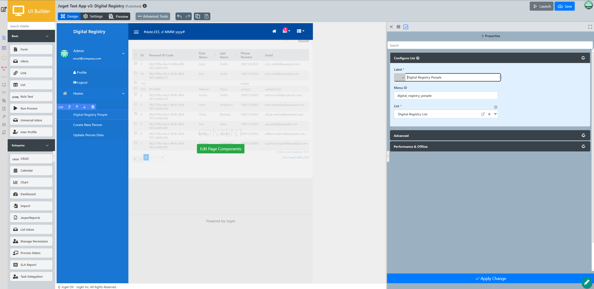

Drag and drop **List** element from the navigation menu to insert the list to the main screen.
Configure the list to point to the [Digital Registry List](../docs/lists.md#digital-registry-bb-emulator-list) through the **List** property on the right side (after list is clicked).

#### Create new person in Digital Registry

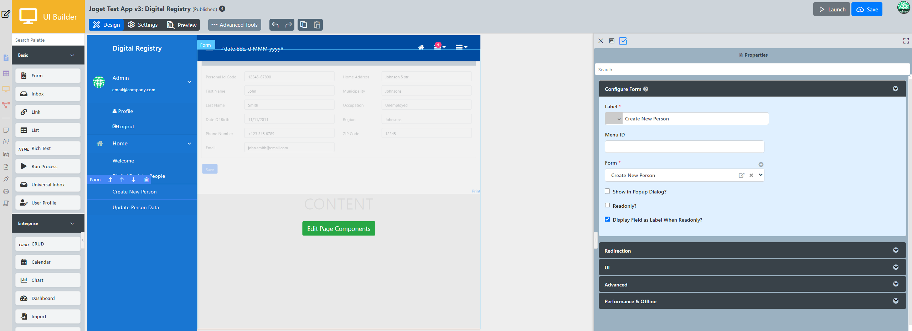

Drag and drop **Form** element into the main screen. Configure the [Form](../docs/forms.md) to be [Create New Person](../docs/forms.md#create-new-person). Edit the form's label as well.

Edit the **Message after submission** as preferred.
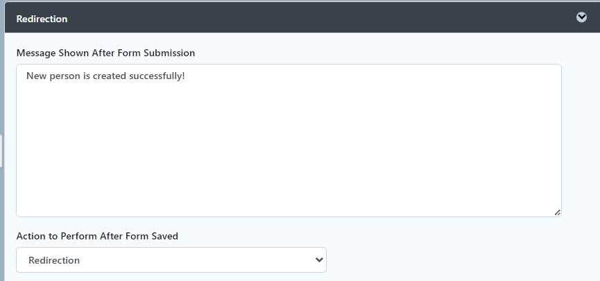

#### Update person's details in Digital Registry

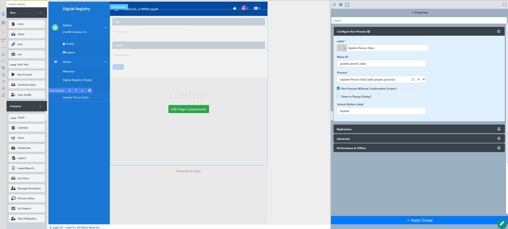

Drag and drop **Run Process** element into the main screen. Configure the [Process](../docs/process.md) to be [Update Person Data](../docs/forms.md#update-person).

Edit the **Submit Button Label** as preferred and check **Run Process Without Confirmation Screen?** if wanted.

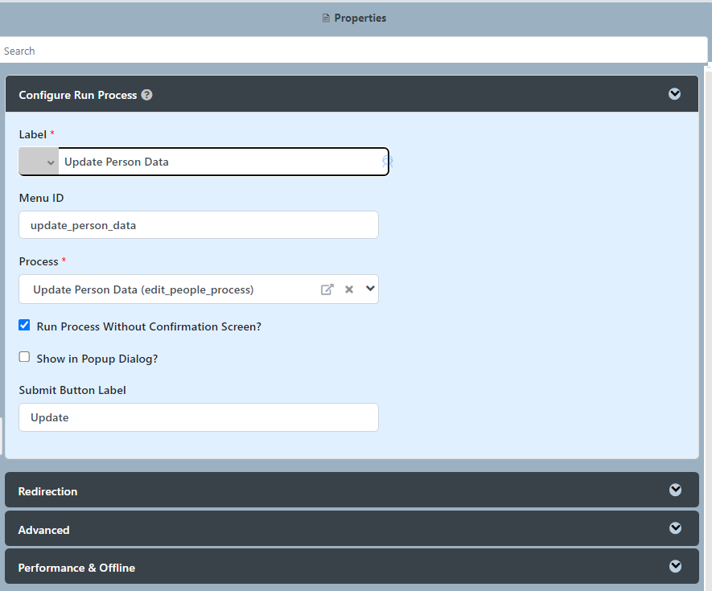

### Digital Registry Beneficiaries
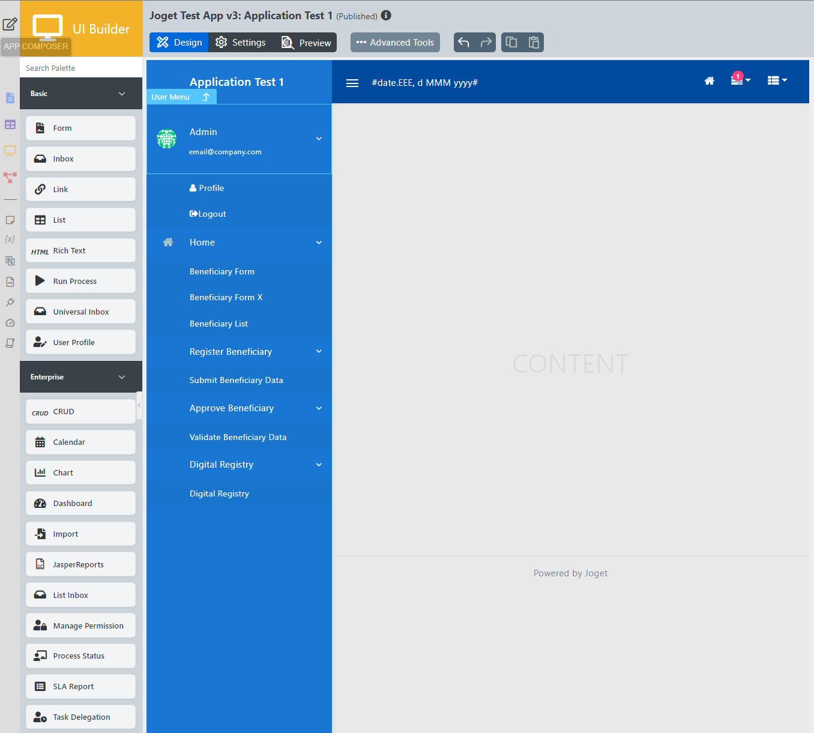

This UI consists of four types of items:
1. Form
2. List
3. Process
4. Inbox

Drag and drop **Form, List, Process or Inbox** element from the navigation menu to insert into to the main screen.
Configure the items to point to the appropriate forms, list, process or assignment  (for the Inbox) through the corresponding property on the right side of the item (after the component is clicked).

#### Beneficiary Form
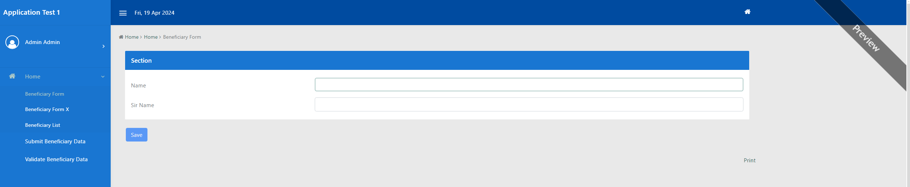

#### Beneficiary List
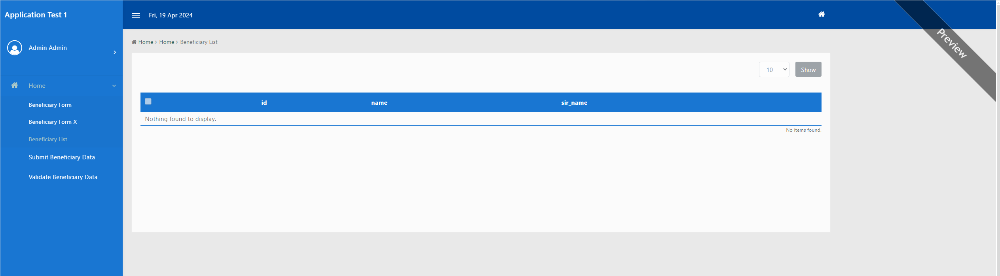

#### Validate Beneficiary
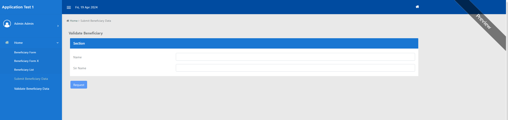

#### Beneficiary Validation Form Submission History
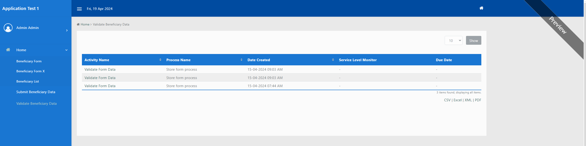

UIs can be previewed with data coming from the datasource directly in **Preview** tab or through the **Launch** button in the top right corner.

### It is recommended to click **Apply Change** after every change made and click Save button in the top right corner to save the progress otherwise it may be lost!